# GoAdmin reference

[](https://github.com/arturrw/go-admin-reference/actions/workflows/ci.yml)
[](https://github.com/arturrw/go-admin-reference/actions/workflows/cd.yml)

A reference admin panel: Go JSON API plus a React SPA, shipped as one binary.
It is not built for a specific business. Use it as a starting point and as a
catalogue of patterns. The domain is a small store with products, orders,
customers, a team, an audit log and a request log, all seeded with fake data.

**Docs:** [Architecture & diagrams](docs/ARCHITECTURE.md) · [API reference](docs/API.md) · [Contributing](CONTRIBUTING.md)

## Screenshots

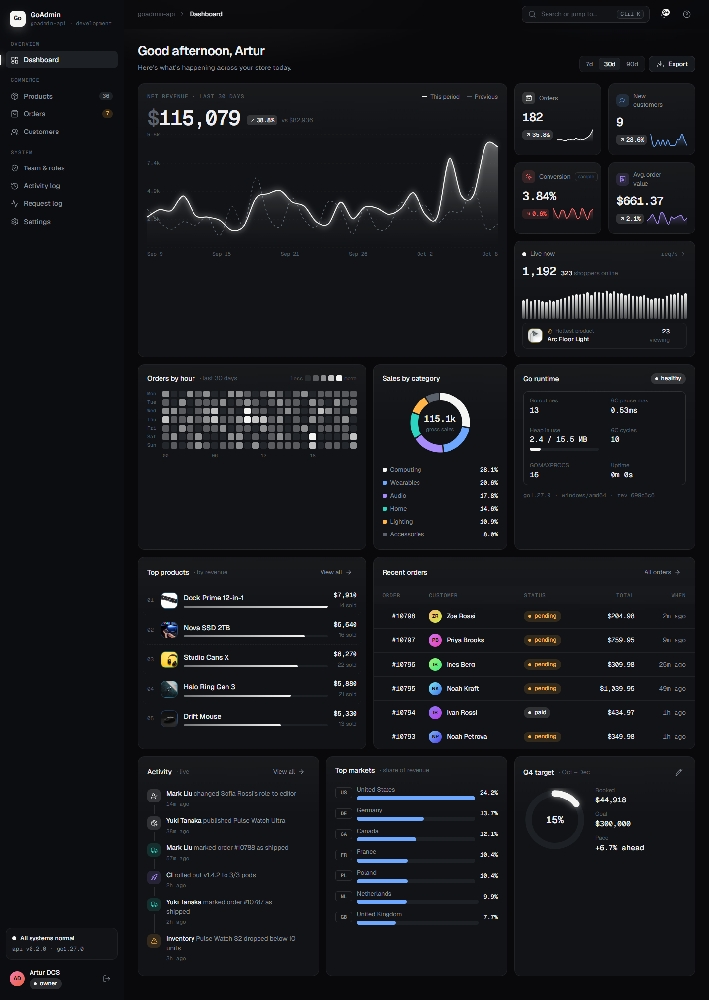

<table>
  <tr>
    <td width="50%"><b>KPI day view</b> — every metric for one day plus its orders<br>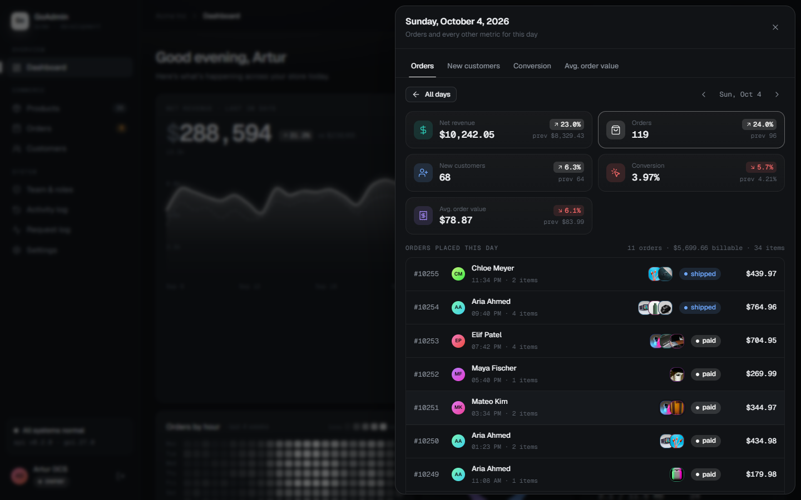</td>
    <td width="50%"><b>Customer</b> — profile, purchase history, refunds, notes<br>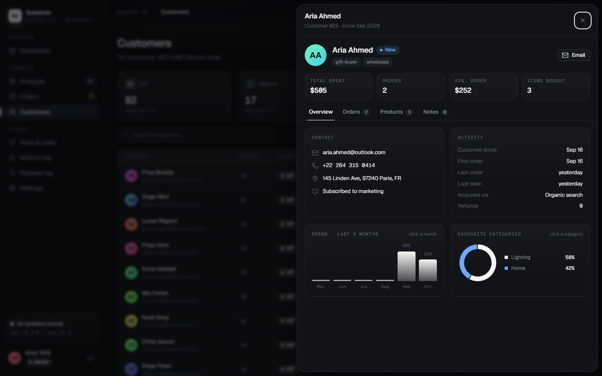</td>
  </tr>
  <tr>
    <td><b>Products</b><br>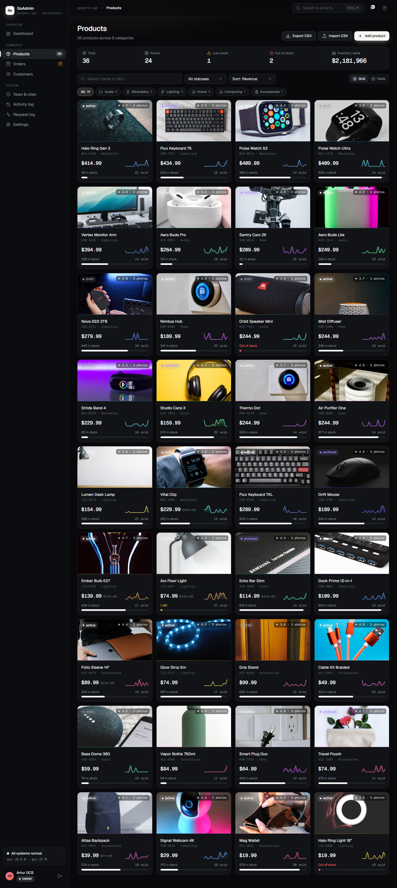</td>
    <td><b>Orders</b><br>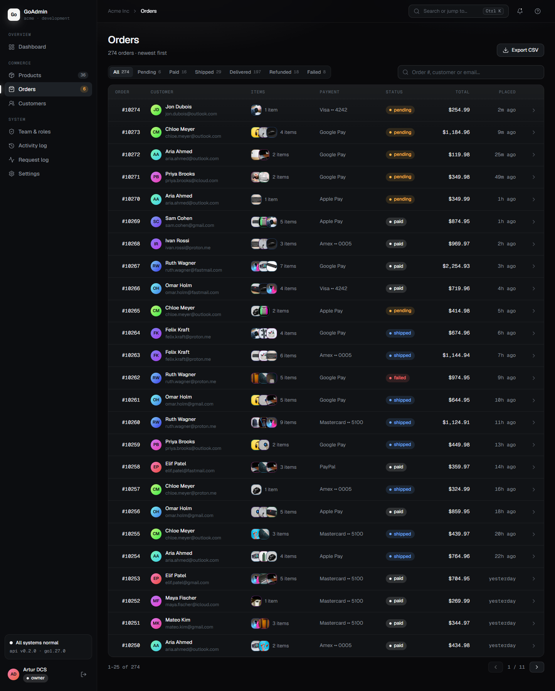</td>
  </tr>
  <tr>
    <td><b>Customers</b><br>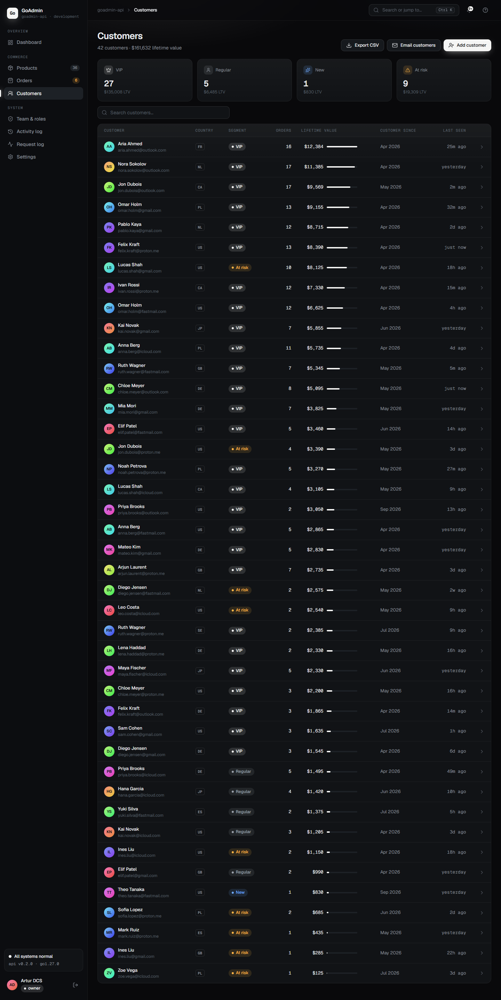</td>
    <td><b>Activity log</b> — everything the team changed<br>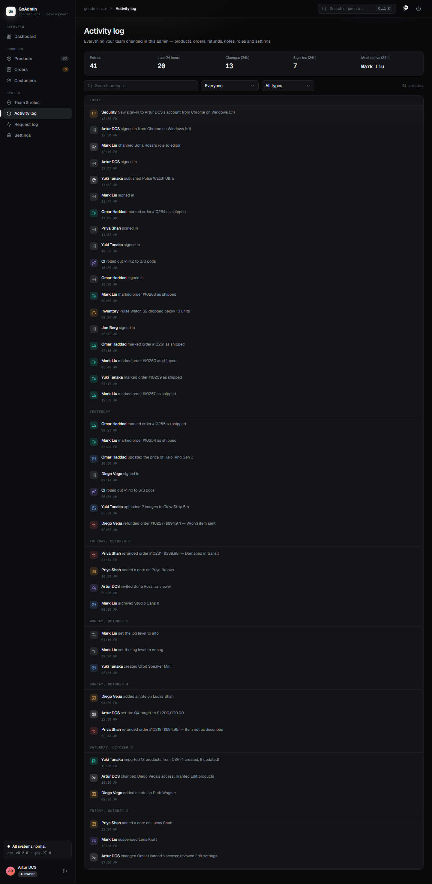</td>
  </tr>
  <tr>
    <td><b>Team & roles</b><br>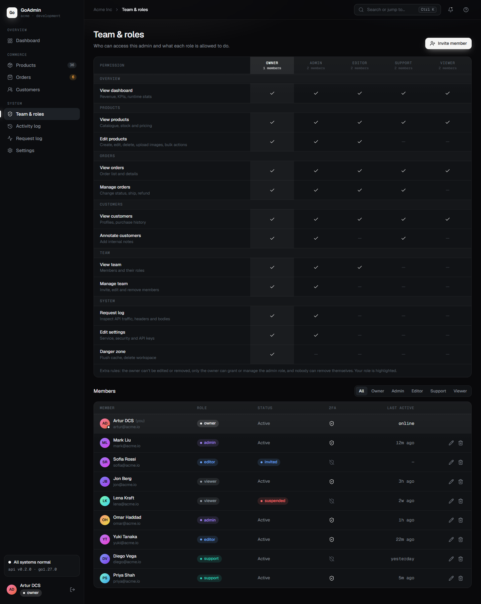</td>
    <td><b>Member access</b> — owner-managed exceptions to the role<br>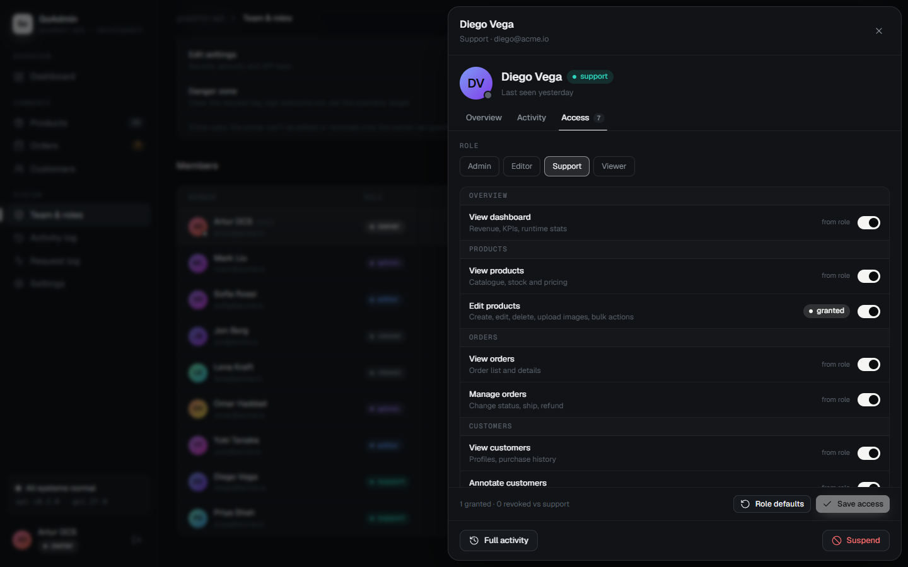</td>
  </tr>
  <tr>
    <td colspan="2"><b>Request log</b><br>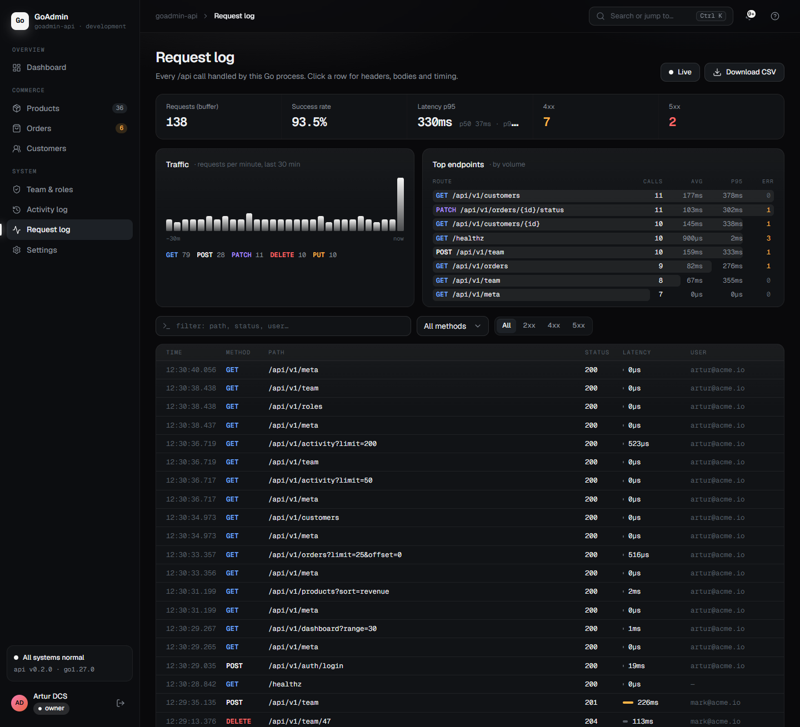</td>
  </tr>
</table>

<table>
  <tr>
    <td width="50%"><b>Phone: dashboard</b><br>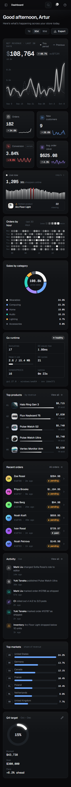</td>
    <td width="50%"><b>Phone: orders</b><br>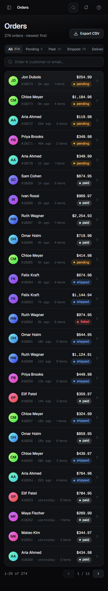</td>
  </tr>
</table>

Screenshots are full pages captured from the demo data by
`cd web && npm run screenshots`.

## What's inside

- **Dashboard.** Revenue and KPIs with per-day drill-downs, a live traffic card
  whose hottest product is picked from live catalogue data, a heatmap, top
  products, recent orders, the live activity feed, and a quarterly target the
  owner can edit.
- **Catalogue.** Product CRUD, image galleries with uploads, bulk actions, and
  CSV import and export.
- **Orders and customers.** Status changes, refunds that require a reason
  (kept in the order and the customer's history), customer profiles, notes
  with delete confirmation, and segments.
- **Team.** RBAC with five roles, plus per-member exceptions the owner sets. A
  member sheet shows presence, recent activity and access, with suspend and
  reactivate.
- **Audit log.** Every change and sign-in, with actor and record, filterable
  by member and type.
- **API keys.** Create read or read-and-write keys in Settings and call the API
  with Authorization: Bearer …. Only a hash is stored, the secret is shown once,
  and revoking works at once.
- **Request log.** Every API call with redacted headers and bodies, latency
  percentiles and traffic charts.
- **In-place sheets.** Records linked from another page open on top of it
  instead of navigating away.
- **Phones.** Every page fits 375px, and tests check it.

## Stack

| Layer    | Choice |
| -------- | ------ |
| API      | Go 1.26+, stdlib `net/http` (method + path patterns), `log/slog` |
| Storage  | PostgreSQL 17 via pgx/v5 + sqlc, goose migrations embedded in the binary; in-memory fallback behind the same `httpapi.Store` interface |
| Frontend | React 19, TypeScript, Vite, Tailwind CSS v4 |
| Data     | TanStack Query (server state), TanStack Router (routes, URL-driven sheets) |
| UI       | Hand-rolled shadcn-style primitives, Radix Dialog, cmdk, sonner, lucide icons, Geist fonts |
| Shipping | `web/dist` is embedded with `go:embed` and served gzipped, so the result is one binary |
| Tests    | Go API tests on both stores, Playwright e2e (desktop + mobile) on both stores |

The design is dark graphite with a white accent. Lime and four other accents
are one click away in Settings → Appearance.

## Run it

Everything in Docker (Postgres, UI and API on http://localhost:8080):

```bash
docker compose up -d --build --wait     # or: make up
```

The `app` image is a multi-stage build ([`Dockerfile`](Dockerfile)): it builds
`web/dist`, embeds it into a static Go binary and runs it on Alpine. Uploads
live in the `uploads` volume.

For development:

```bash
docker compose up -d --wait postgres    # Postgres on :5433 (also creates goadmin_test)
make dev-api                            # API on :8080; migrates and seeds an empty database
cd web && npm install && npm run dev    # UI on :5173 with hot reload
```

Without `DATABASE_URL` the server falls back to the in-memory store
(`make dev-api-mem`). It runs without Docker but resets on every restart.

Or run the published image (in-memory demo data, no database needed):

```bash
docker run --rm -p 8080:8080 ghcr.io/arturrw/go-admin-reference:latest
```

Single binary:

```bash
cd web && npm ci && npm run build && cd ..
go build -o bin/server ./cmd/server
./bin/server        # UI + API on http://localhost:8080
```

### Demo accounts

The password is `goadmin`. In development the login page has one-click buttons.

| Account | Role |
| ------- | ---- |
| artur@acme.io (Artur DCS) | owner |
| mark@acme.io | admin |
| yuki@acme.io | editor |
| priya@acme.io | support |
| jon@acme.io | viewer |

### Configuration

| Variable | Default | |
| -------- | ------- | - |
| `ADDR` | `:8080` | listen address |
| `APP_ENV` | `development` | `production` switches logs to JSON, sets `Secure` cookies and hides demo accounts |
| `DATABASE_URL` | empty | Postgres DSN; empty means the in-memory store |
| `SEED` | `true` | load demo data into an empty database (and backfill older demo databases) |
| `LOG_LEVEL` | `info` | start-up level; owners and admins can change it at runtime |
| `UPLOAD_DIR` | `data/uploads` | where uploaded images go |
| `SESSION_TTL` | `12h` | sliding session lifetime |
| `APP_VERSION` | `v0.2.0` | shown in the UI and `/meta` |

See [`.env.example`](.env.example).

## Roles

| Permission | owner | admin | editor | support | viewer |
| ---------- | :---: | :---: | :----: | :-----: | :----: |
| Dashboard | ✓ | ✓ | ✓ | ✓ | ✓ |
| View products / orders / customers | ✓ | ✓ | ✓ | ✓ | ✓ |
| Edit products, upload images | ✓ | ✓ | ✓ | | |
| Change order status, refund | ✓ | ✓ | ✓ | ✓ | |
| Customer notes | ✓ | ✓ | | ✓ | |
| View team, activity log | ✓ | ✓ | ✓ | | |
| Manage team | ✓ | ✓ | | | |
| Request log | ✓ | ✓ | | | |
| Edit settings | ✓ | ✓ | | | |
| Danger zone, quarterly target | ✓ | | | | |

The matrix lives in `internal/domain/team.go`. The API enforces it on every
route, and the UI reads it from `/api/v1/roles`. On top of the role, the owner
can grant or revoke single permissions for one member, and the API checks the
effective set (role + granted − revoked). More rules: the owner can't be edited,
suspended or removed, only the owner manages admins, the danger zone can't be
granted, and nobody can remove or suspend themselves. See
[Architecture → Access control](docs/ARCHITECTURE.md#access-control).

## Tests

```bash
go test ./...                 # API tests on the in-memory store
make test-pg                  # the same on Postgres + memory/Postgres parity test
cd web && npm run e2e         # Playwright (desktop + 375px mobile) against the in-memory server
cd web && npm run e2e:pg      # Playwright against a fresh Postgres database
```

Locally the e2e suite uses the installed Chrome. With `CI=1` it uses
Playwright's bundled Chromium (`npx playwright install chromium`). The suite
has 42 tests covering auth, every page, refunds, notes, member access, the
activity log, charts and phone layouts. It passes on both stores.

## CI/CD

GitHub Actions in [.github/workflows](.github/workflows):

- **CI** (ci.yml) runs on every push to main and every pull request: gofmt
  and go vet, Go tests on both stores (Postgres as a service container), a check
  that the sqlc-generated code is current, the web typecheck and build, the full
  Playwright suite on both stores, and a smoke test that the Docker image starts
  and answers /healthz. Failed e2e runs upload their traces.
- **CD** (cd.yml) publishes the image to GitHub Container Registry as
  `ghcr.io/arturrw/go-admin-reference`: `:latest` and `:sha-<commit>` after CI
  passes on main, and `:1.2.3` / `:1.2` when a `v*` tag is pushed.

## Learn more

- [**Architecture**](docs/ARCHITECTURE.md): system and request-flow diagrams,
  the data model, access control, frontend structure, code layout and patterns
  worth copying.
- [**API reference**](docs/API.md): conventions, errors, every endpoint with
  its permission, and curl examples.
- [**Contributing**](CONTRIBUTING.md): setup, the pre-PR checklist, and recipes
  for adding endpoints, migrations and pages.

## Roadmap

- Object storage (S3) for uploads instead of local disk
- Background job that rebuilds the dashboard rollups from orders
- Password reset and invite acceptance flows, 2FA
- OpenAPI spec and a generated TS client

Seed product photos come from [Unsplash](https://unsplash.com/license) (`internal/seed/photos.go`).
