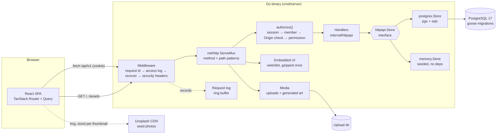
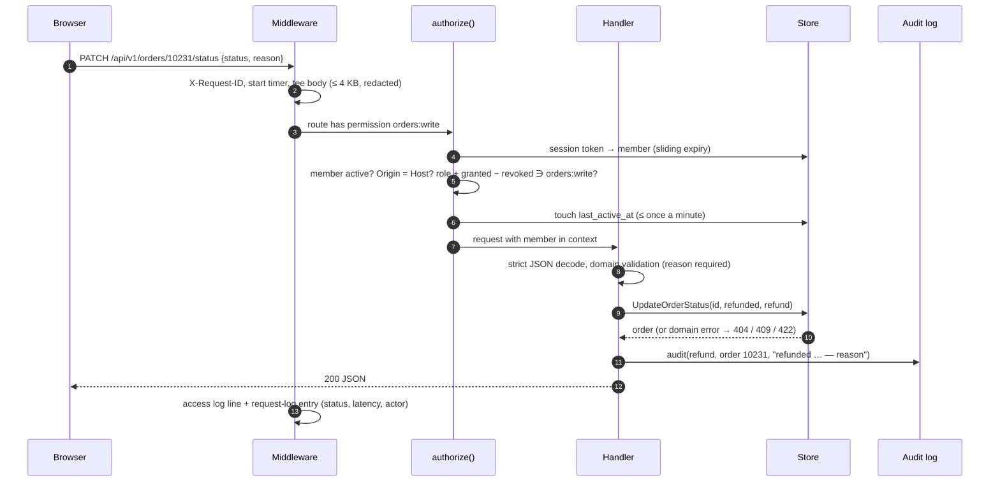
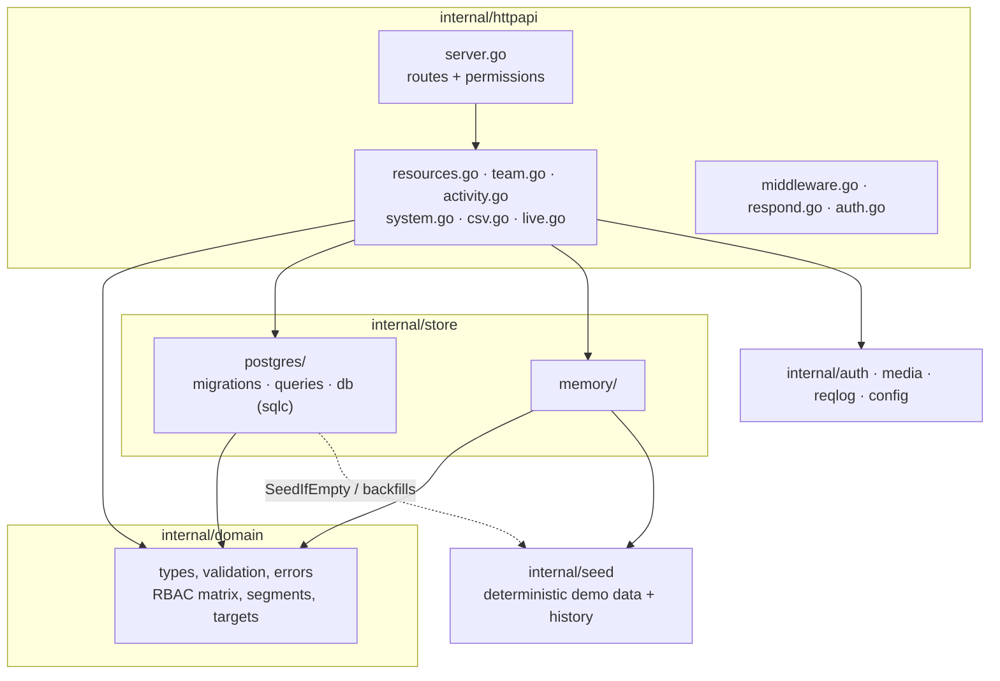
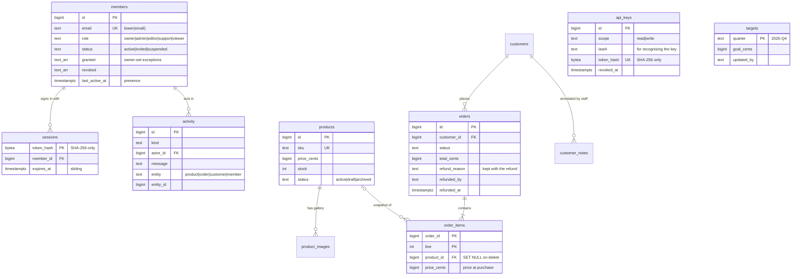
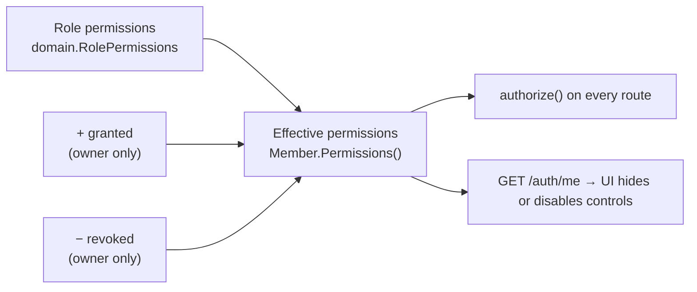
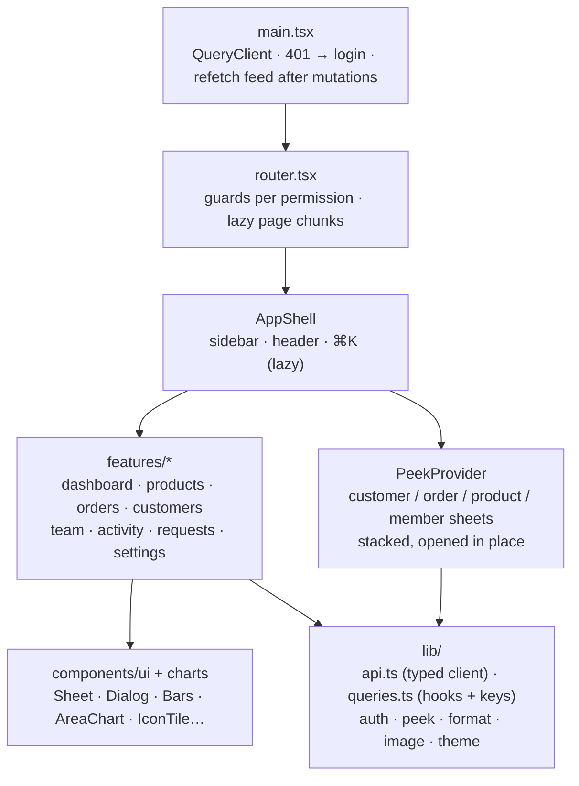

# Architecture

[← README](../README.md) · [API reference](API.md) · [Contributing](../CONTRIBUTING.md)

GoAdmin is one Go binary. It serves a JSON API under `/api/v1` and the React
single-page app that is built into it with `go:embed`. State lives in
PostgreSQL, or in memory when no database is configured.

## System overview



- **One deployable.** `web/embed.go` serves `web/dist` with an SPA fallback.
  Hashed assets are cached forever, and text files are gzipped once and kept in
  memory.
- **Two stores, one interface.** `httpapi.Store` is declared where it is used.
  `postgres.Store` is the real one. `memory.Store` runs without dependencies. The
  same handler tests run against both, and a parity test compares their output.
- **No framework.** Routing is the stdlib `ServeMux` with method and path
  patterns, and logging is `log/slog`. Auth is opaque session tokens and PBKDF2.

## Request lifecycle



Every write goes through these steps. The UI then invalidates its cached
queries. A global `MutationCache.onSuccess` refreshes the activity feed and the
dashboard after any change.

## Backend layers



`domain` imports nothing from the project. Handlers depend on `domain` and the
`Store` interface, never on a concrete store.

## Data model



Not shown: `customer_notes`, `product_images`, the dashboard rollups
(`revenue_daily`, `orders_heatmap`), and the `customers_v` view, which derives
order count, LTV, last order and segment.

- **Money is `bigint` cents** everywhere, in the API too.
- **Derived data stays derived.** Customer metrics come from `customers_v`. The
  view mirrors `domain.CustomerSegment`, and the parity test keeps them in sync.
- **Order lines are snapshots**, so editing or deleting a product doesn't
  rewrite history. Order images follow the product's current cover while it
  exists.
- **Sessions live in Postgres** as token hashes, with sliding expiry and an
  hourly purge. Logins survive restarts and work across several instances.
- **Errors map to the domain.** In `mapErr`, unique and check violations become
  422 and missing rows become 404, so handlers never see Postgres errors.
- **Migrations** are goose files embedded in the binary and applied on boot:

  | File | Adds |
  | ---- | ---- |
  | `00001_init.sql` | core schema, `customers_v` |
  | `00002_activity_audit.sql` | actor and record links on `activity` |
  | `00003_order_refunds.sql` | refund reason, who and when |
  | `00004_member_access.sql` | per-member `granted` / `revoked` |
  | `00005_targets.sql` | quarterly revenue goals |
  | `00006_api_keys.sql` | server-to-server API keys (hashed) |

- **Seeding and backfills.** An empty database gets the demo dataset. Older
  demo databases get refund reasons and a week of staff history once, on boot
  (with `SEED=true`).

## Access control



The owner always has everything, and the danger zone (`workspace:manage`) can't
be granted. Only the owner manages admins, individual exceptions and the
quarterly target. Nobody can remove or suspend themselves. The full matrix is
in the [README](../README.md#roles).

## Frontend



- **Server state is TanStack Query.** Keys are grouped by resource
  (`['orders', filter]`), so a mutation can invalidate everything that depends
  on it with one prefix.
- **Sheets come in two kinds.** A list page's own sheet is URL-driven
  (`/orders?view=10231`, deep-linkable). Anything opened from another page
  peeks in place, and closing it returns to the previous sheet.
- **Code splitting.** Each page, the peeked sheets and the command menu are
  separate chunks.
- **Design tokens.** Tailwind v4 `@theme` colors are CSS variables, so Settings
  → Appearance recolors the UI live. White is the default accent.
- **Phones.** Below 640px, tables give way to compact rows (orders) or keep
  only the key columns. Wide grids scroll inside their card, never the page. The
  mobile e2e suite enforces this.

## Code layout

```
cmd/server/              entrypoint: config, logger, store selection, backfills, graceful shutdown
internal/config/         env config
internal/auth/           PBKDF2 password hashing, in-memory sessions
internal/domain/         types, validation, errors, RBAC, aggregations (money in cents)
internal/seed/           deterministic demo dataset and activity history
internal/store/postgres/ migrations/ (goose) · queries/ (sqlc input) · db/ (generated) · store.go · sessions.go · seed.go
internal/store/memory/   in-memory store
internal/reqlog/         ring buffer behind the Request log page
internal/media/          upload storage, generated SVG artwork
internal/httpapi/        routes, middleware, handlers, API tests
web/                     Vite app; embed.go serves dist/ (gzip, SPA fallback)
  src/components/          ui primitives, charts, layout
  src/features/<page>/     one folder per page
  src/lib/                 api client, query hooks, peek, formatters, theme
  e2e/                     Playwright specs (desktop + mobile)
  scripts/                 e2e on Postgres, README screenshots
docs/                    architecture, API reference, screenshots
```

## Patterns worth copying

- **Strict JSON decoding.** Bodies are capped, and unknown fields or trailing
  data are rejected (`decodeJSON`).
- **Domain errors map to HTTP in one place** (`writeDomainError`).
- **Audit next to the change.** Handlers call `s.audit(...)` after a write
  succeeds. A failure to log never fails the request.
- **Safe uploads.** The content type is sniffed, files get random names, SVG is
  refused, and uploads are served with a strict CSP.
- **Request log with redaction.** Cookies, auth headers and password or token
  fields are masked before anything is stored.
- **Simulated where there is no source.** Storefront traffic is a deterministic
  function of time, so polls agree. Catalogue data (the hottest product, stock,
  sales) stays real.
